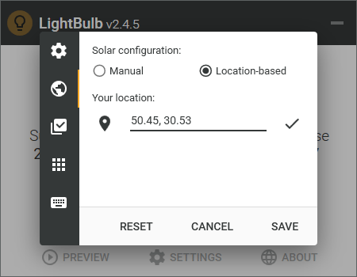

# LightBulb EyeCare

> 一个 Windows 护眼工具。基于 [Tyrrrz/LightBulb](https://github.com/Tyrrrz/LightBulb) 改造，加了一键预设、20-20-20 休息提醒、真·灰度阅读模式。MIT 许可。
>
> *A Windows eye-care utility. Fork of [Tyrrrz/LightBulb](https://github.com/Tyrrrz/LightBulb) with color presets, 20-20-20 break reminders and a true grayscale reading mode. Licensed under MIT.*

**这不是上游 LightBulb 的官方版本。** 上游的说明和下载请看 [Tyrrrz/LightBulb](https://github.com/Tyrrrz/LightBulb)。

---

## 它能干什么

**上游自带的能力**（原样保留）：

- 按日出日落时间自动调整屏幕色温，白天冷、夜间暖
- 支持定位或手填经纬度，也可手动指定日出日落时间
- 色温/亮度平滑过渡，性能开销极低，断网可用
- 敏感应用白名单（比如修图软件不被染色）
- 全局快捷键随手调节

**这个 fork 加的三块**：

| 功能 | 说明 |
|---|---|
| **8 个一键预设** | 阅读 / 办公 / 夜间 / 电影 / 编码 / 游戏 / 护眼 / 自定义，每个预设是一组「色温 + 亮度 + 饱和度」 |
| **20-20-20 休息提醒** | 连续用屏到设定时长后弹全屏遮罩，强制你看 6 米外 20 秒；16 条护眼文案随机出现，不会翻来覆去同一句 |
| **真·灰度阅读模式** | 「阅读」预设会整屏去饱和，像纸质书。**不是**用色温硬凑的假黑白 —— 走的是 Windows Magnification API 的全屏颜色矩阵 |

## 为什么灰度要单独实现

显示器的 gamma 查找表是**逐通道独立**映射的，三条曲线再怎么调也没法把红色像素变成灰色。真正的去饱和需要通道之间加权混合，所以这里改用了 Windows 的 Magnification API（`MagSetFullscreenColorEffect`）给整个桌面套一个 5×5 颜色变换矩阵，权重取 Rec.709 亮度系数。

实现里踩过两个坑，都写在 `LightBulb.PlatformInterop/MagnificationInterop.cs` 的注释里了：传参必须用 `Marshal.AllocHGlobal` 手动封送，以及矩阵的 25 个浮点数是**按列**排列的（按行写会得到整屏绿色）。想自己改矩阵的话先看那段注释。

## 截图



> 上图为**上游原版 v2.4.5** 的设置界面（MIT，随上游代码库一并授权），仅示意基本形态；本 fork 的预设面板和休息遮罩界面请在 Releases 里实际运行查看。

## 构建

需要 **.NET 10 SDK**（见 `global.json`，要求 `10.0.100` 以上、`rollForward: latestFeature`）。

```bash
git clone https://github.com/duhaoda/lightbulb-eyecare.git
cd lightbulb-eyecare

# 构建
dotnet build LightBulb.slnx --configuration Release

# 跑测试
dotnet test --configuration Release

# 出便携版（以 win-x64 为例）
dotnet publish LightBulb --configuration Release --runtime win-x64 --self-contained
```

只有 Windows 能完整构建：主项目目标框架是 `net10.0-windows`，并且用到 Win32 互操作。CI 里 `format` / `test` 两个 job 跑在 Linux 上，`pack` 跑在 Windows 上。

## 与上游的关系、以及版权

- 上游：[Tyrrrz/LightBulb](https://github.com/Tyrrrz/LightBulb) **v2.7.2**，MIT，Copyright (c) 2017-2026 Oleksii Holub。根目录 `License.txt` 是 MIT 许可证**原文，未做任何改动**。
- 我做的修改同样以 MIT 发布。
- **详细的改动清单、灵感来源声明、全部第三方依赖的许可证列表，都在 [NOTICE.md](NOTICE.md) 里**，包括 CareUEyes 相关声明的完整说明，请一并阅读。

### 一句话说清 CareUEyes 的关系

「20-20-20 休息提醒」和「一键预设模式」这两个**功能思路**的灵感来自商业软件 CareUEyes。我们**没有使用它的任何代码、图标、界面素材或文案**，也与它没有任何关联或背书关系 —— 它是闭源软件，本来也没有源码可抄，全部代码都是独立写的。著作权保护表达、不保护功能与思路，所以这不构成侵权。**如果你（或你代表的权利人）觉得不妥，提个 issue，我们核实后立刻改或删。**

### 免责

按 MIT 许可证「按原样」提供，不提供任何担保。调整屏幕色彩与 gamma 属于硬件输出层操作，请自行判断使用风险。本项目与 LightBulb 上游作者、CareUEyes 开发者均无隶属关系。
